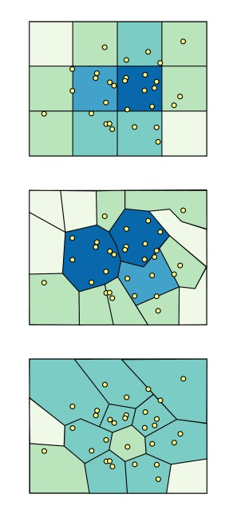
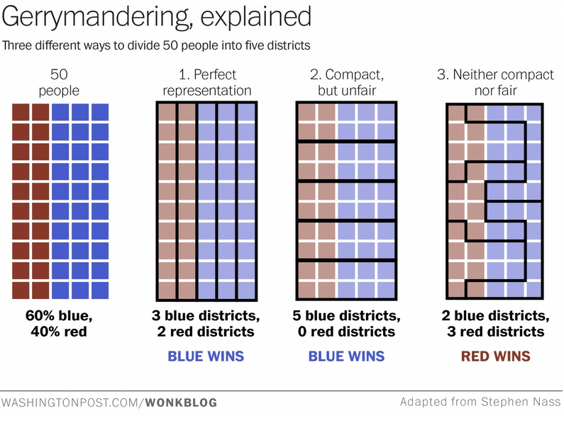

```{r setup, include=FALSE}
knitr::opts_chunk$set(echo = TRUE, message=FALSE, cache=TRUE)
```

## Types of geographic data
There are three main types of geographic data:

- points 
- lines
- polygons

People often also talk about images as geographic data, because so many maps come that way (tiles from googlemaps and OpenStreetMap, satellite imagery). So, we could also think about the difference between

- vector data (lines and polygons), and
- raster data (images)

## Tiles

Mapbox has a [nice explanation](https://www.mapbox.com/help/how-web-maps-work/) of how map tiles work. Let's check it out! 

# Points

## Making a map with points in R with leaflet

We're going to be doing a lot of the stuff from the RStudio [leaflet tutorial](https://rstudio.github.io/leaflet/).

```{r}
library(leaflet)
```

```{r}
m <- leaflet() %>%
  addTiles() %>%  # Add default OpenStreetMap map tiles
  addMarkers(lng=-93.2650, lat=44.9778, popup="Minneapolis!")
m
```

## We need more data!!

Lets look at [storm data](http://www.ncdc.noaa.gov/stormevents/ftp.jsp) from the NOAA. It comes in a few files that we need to join together in order to use. 

```{r}
library(readr)
library(dplyr)
stormlocs <- read_csv("StormEvents_locations-ftp_v1.0_d2016_c20160810.csv")
stormdetails <- read_csv("StormEvents_details-ftp_v1.0_d2016_c20160810.csv")
stormlocs <- stormlocs %>%
  left_join(stormdetails, by="EVENT_ID")
lightning <- stormlocs %>%
  filter(EVENT_TYPE=="Lightning")
```

## Mapping the lightning
Now, we can programmatically map them. 
```{r}
m <- leaflet(data=lightning) %>%
  addTiles() %>%  # Add default OpenStreetMap map tiles
  addMarkers(~LONGITUDE, ~LATITUDE)
m
```

## Find another storm type to map
Bonus-- add popups!


# Lines

## I don't have much to say here
- Streets?
- ??

# Polygons

## Lets start with something easy(ish) -- circles

```{r}
tornados <- stormlocs %>%
  filter(EVENT_TYPE=="Tornado")
```

```{r}
m <- leaflet(data=tornados) %>%
  addTiles() %>%  # Add default OpenStreetMap map tiles
  addCircles(~LONGITUDE, ~LATITUDE, weight = 1, radius = ~DAMAGE_PROPERTY, popup = ~EVENT_NARRATIVE)
m
```

## But usually, you want polygons

## Polgyons come in shapefiles
Most boundaries (state, national, etc) are provided in terms of polygons. Major mapping software ArcGIS, from ESRI, has essentially set the standard formats. 

## State shapefiles
I got these from [the Census](https://www.census.gov/geo/maps-data/data/cbf/cbf_state.html). You can choose the resolution. 

```{r}
library(rgdal)
states <- readOGR("cb_2015_us_state_500k", layer = "cb_2015_us_state_500k", verbose = FALSE)
```


## Need to count up some data
```{r}
tornadocount <- tornados %>%
  group_by(STATE) %>%
  summarize(n=n())

```


## Colors are tricky!

[colorbrewer](http://colorbrewer2.org/#type=sequential&scheme=BuGn&n=3)

```{r}
colors <- c("#edf8fb", "#b2e2e2", "#66c2a4", "#238b45")
tornadocount <- tornadocount %>%
  mutate(color = cut(n, breaks=quantile(n)))

# Baaaaad factor practice. Do as I say, not as I do?!
levels(tornadocount$color) <- colors
```


## Joining data
```{r}
states@data <- left_join(states@data, tornadocount, by=c("NAME"="STATE"))
```


## Putting it all together (?)
```{r}
# Not currently working
leaflet(data=states) %>%
  addTiles() %>%
  addPolygons(stroke = FALSE, fillOpacity = 0.5, smoothFactor = 0.5, color = ~states@data$color)
```

## Modifiable areal unit problem



[An introduction to the Modifiable Areal Unit Problem](http://gispopsci.org/maup/)

## Gerrymandering



[The best explanation of gerrymandering you will ever see](https://www.washingtonpost.com/news/wonk/wp/2015/03/01/this-is-the-best-explanation-of-gerrymandering-you-will-ever-see/)


