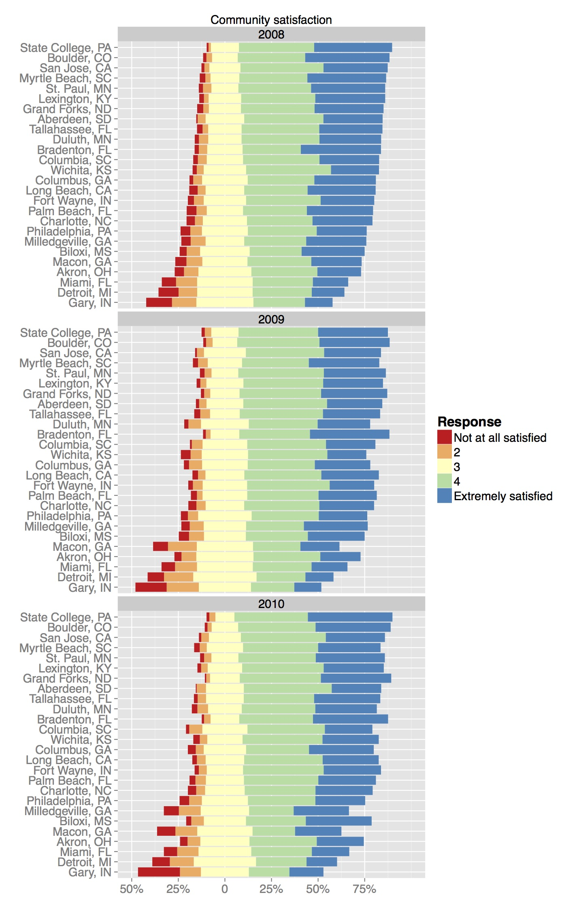

## R graphics
There are many ways to make graphics in R.

- base R
- lattice graphics
- ggplot2 

## ggplot2
ggplot2 is an R package by Hadley Wickham that lets you make beautiful R graphics (relatively) easily. 

It's part of the tidyverse, which I recommend everyone get to know (dplyr, stringr, lubridate, broom... and many more).

The name ggplot2 refers to a famous book on data visualization theory called The Grammar of Graphics.

```{r, echo=FALSE, message=FALSE, warning=FALSE}
require(knitr)
opts_chunk$set(cache=TRUE, warning=FALSE, message=FALSE, fig.align='center')
```

## Getting started
First, we need to install and load the package,
```{r}
#install.packages("ggplot2")
library(ggplot2)
```

## Diamonds data
To start, I'm going to use the diamonds data that comes with ggplot2,
```{r}
str(diamonds)
```

## ATUS data

You guys are going to get to follow along with the diamonds data, but also try things out on the American Time Use Survey data. 

I've given you this data [here](https://github.com/AmeliaMN/SummerDataViz/blob/master/ggplot2_intro/atus.csv). You can download this the point-and-click way, or do it programmatically. 

```{r}
library(RCurl)
htmlData <- getURL("https://raw.githubusercontent.com/AmeliaMN/SummerDataViz/master/ggplot2_intro/atus.csv")
atus <- read.csv(text = htmlData)
```

## qplot()-- the easy way out
```{r, plot.height=2}
qplot(carat, data=diamonds)
```

## ggplot2 syntax
```{r, eval=FALSE}
qplot(carat, data=diamonds)
```
qplot() performs similar functionality to the base R graphics function plot(). But it aleady  might seem a little different, because we're not using the $ operator. 

Instead, you're listing the name of the variable(s) and then telling R where to "look" for that variable with "data=". This is like what we do when modeling using functions like lm().

## More qplot()

```{r}
qplot(clarity, fill=cut, data=diamonds)
```

## ggplot()

But, in order to really harness the power of ggplot2 you need to use the more general ggplot() command. The idea of the package is you can "layer" pieces on top of a plot to build it up over time.

You always need to use a ggplot() call to initialize the plot. I usually put my dataset in here, and at least some of my "aesthetics." But, one of the things that can make ggplot2 tough to understand is that there are no hard and fast rules. 
```{r}
p1 <- ggplot(aes(x=clarity, fill=cut), data=diamonds)
```
If you try to show p1 at this point, you will get "Error: No layers in plot." This is because we haven't given it any geometric objects yet. 


## geoms
In order to get a plot to work, you need to use "geoms" (geometric objects) to specify the way you want your variables mapped to graphical parameters.

```{r, message=FALSE, fig.height=3}
p1 + geom_bar()
```

## geoms have options

```{r}
p1 + geom_bar(position="dodge")
```

## Lots of options
```{r}
p1 + geom_bar(position="fill")
```


## Two variables
```{r}
p2 <- ggplot(aes(x=carat, y=depth), data=diamonds)
p2 + geom_point()
```

## Same data, different geom
```{r}
p2 + geom_bin2d()
```

## Saving your work (or not)
Notice that I'm not saving these geom layers-- I'm just running 

p2 + [something] 

to see what happens. But, I can save the new version to start building up my plot,
```{r}
p2 <- p2 + geom_bin2d()
```

## Better labels
```{r}
p2 <- p2 + xlab("Carat") + ylab("Depth") + 
 guides(fill=guide_legend(title="Number of diamonds"))
p2
```

## Different breaks
```{r}
p2 + scale_fill_continuous(breaks=c(1500, 2500, 3500,4500))
```

## Log scale
```{r}
p2 + scale_fill_continuous(trans="log")
```

## Log scale, different breaks
```{r}
p2 + scale_fill_continuous(trans="log", breaks=c(1,10,100,1000,5000))
```

## Faceting (wrapping)
```{r}
p2 + facet_wrap(~color)
```

## Faceting (grid)
```{r}
p2 + facet_grid(color~clarity)
```

## Working with dates
```{r}
# install.packages("lubridate")
# install.packages("dplyr")
library(lubridate)
library(dplyr)
```

## Data with dates
```{r}
econ <- economics
str(econ)
econ <- econ %>%
  mutate(date = ymd(date)) 
old <- econ %>%
  filter(year(date)<"1970")
old <- old %>%
  mutate(date = ymd(date))
```

##
```{r}
p3 <- ggplot(data=old) + geom_line(aes(x=date, y=pce))
p3
```

## For nicer date formatting
```{r}
# install.packages("scales") 
library(scales)
```

##
```{r}
p3 + 
  scale_x_date(breaks = date_breaks("3 months"), 
                   labels = date_format("%b %Y"))
```

##
```{r}
p3 + 
  scale_x_date(breaks = date_breaks("6 months"), 
                   labels = date_format("%B %y"))
```

## Working with geographic data

```{r}
#install.packages("ggmap")
library(ggmap)
```

## 
```{r}
str(crime) # crime data from ggmap package
library(mosaic)
```

## 
```{r}
midlat <- mean(~lat, data=crime, na.rm=TRUE)
midlon <- mean(~lon, data=crime, na.rm=TRUE)
m1 <- get_map(source='stamen', location=c(midlon, midlat), 
              maptype="watercolor", zoom=11)
p4 <- ggmap(m1)
p4 
```

## With points
```{r}
p4 + geom_point(aes(x=lon, y=lat), data=crime)
```

##
```{r}
p4 + 
  coord_cartesian() +
  geom_hex(aes(x=lon, y=lat), data=crime, alpha=0.8) + 
  guides(fill=guide_legend(alpha=0.5, title="Number of crimes")) + 
  xlab("") + ylab("") + theme(axis.line=element_blank(), 
                              axis.text=element_blank(), 
                              axis.ticks=element_blank(),
                              axis.title=element_blank())
```

## Many layers
```{r, eval=FALSE}
baseplot <- ggplot() + 
  aes(x=citystate, y=Freq, fill = Response, order=Response) +
  facet_wrap(~year, nrow=3)+geom_bar(data = trial2$neg, stat = "identity") + 
  scale_fill_manual(breaks=c("Not at all satisfied", "2", "3", "4", 
                             "Extremely satisfied"), values=colorsB, 
                    name="Response") + 
  geom_bar(data = trial2$pos, stat = "identity") + coord_flip() + 
  ggtitle("Community satisfaction") + xlab("") +ylab("") + 
  scale_y_continuous(limits=c(-0.5, 1), 
                     breaks=seq(from=-0.5, to=0.75, by=0.25), 
                     labels=c("50%", "25%", "0", "25%", "50%", "75%")) + 
  theme(legend.text=element_text(size=14), 
        legend.title=element_text(size=16), 
        axis.text=element_text(size=14), 
        strip.text=element_text(size=14))
baseplot 
```

## {.flexbox .vcenter}


## Colors

```{r}
# install.packages("RColorBrewer")
library(RColorBrewer)
display.brewer.all(n=5, type="qual")
```

## 
```{r}
p1 + geom_bar(position="dodge") + scale_fill_brewer(palette="Dark2")
```

## Saving your work 

```{r, echo=FALSE}
p4 <- p4 + 
  coord_cartesian() +
  geom_hex(aes(x=lon, y=lat), data=crime, alpha=0.8) + 
  guides(fill=guide_legend(alpha=0.5, title="Number of crimes")) + 
  xlab("") + ylab("") + theme(axis.line=element_blank(), 
                              axis.text.x=element_blank(), 
                              axis.text.y=element_blank(), 
                              axis.ticks=element_blank(),
                              axis.title.x=element_blank(), 
                              axis.title.y=element_blank())
```

```{r, eval=FALSE}
ggsave("beautiful_hex_map.jpg", plot=p4)
```

## Challenge questions

- Make a stacked bar chart of `atus` data, but change the color scheme.

- Make a scatterplot of `atus` data, but remove the grey-and-white background.

- Make a plot that helps you determine which state has the most veterans. 

- Are most veterans married or not?


## Resources for ggplot2

* [ggplot2 cheatsheet](http://www.rstudio.com/wp-content/uploads/2015/03/ggplot2-cheatsheet.pdf)
* [R graphics cookbook](http://www.cookbook-r.com/Graphs/)
